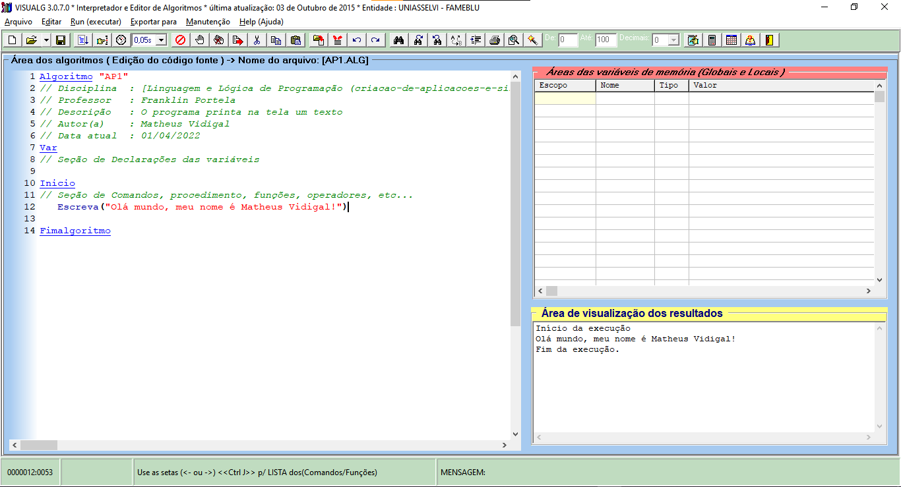

<h1 align="center">
    
</h1>
<h3 align="center">
    
    Criação de Aplicações e Sistemas
    
</h3>
<p align="center">
    
    
    
    <a href="https://github.com/Descomplica-ADS/CAS/blob/main/LICENSE">
        
    </a>
</p>
<p align="center">
    <a href="#cas-">Projetos</a>&nbsp;&nbsp;&nbsp;|&nbsp;&nbsp;&nbsp;
    <a href="#tecnologias-">Tecnologias</a>&nbsp;&nbsp;&nbsp;|&nbsp;&nbsp;&nbsp;
    <a href="#screenshots-">Screenshots</a>&nbsp;&nbsp;&nbsp;|&nbsp;&nbsp;&nbsp;
    <a href="#licença-%EF%B8%8F">Licença</a>
</p>

# CAS ☕
Projetos desenvolvidos durante as aulas do segundo trimestre de Análise e Desenvolvimento de Sistemas da Faculdade Descomplica Digital.

## Tecnologias 🚀
Esses projetos foram desenvolvidos com as seguintes tecnologias:
- [VisuAlg](https://visualg3.com.br)

## Screenshots 🚧
<div style="display: flex; flex-direction: 'column'; align-items: 'center';">
    
</div>
<a href="./.github/README-IMGS.md">Ver mais</a>

## Rodando os projetos 🚴🏻‍♂️
#### "Só vou dar uma olhadinha...":
Navegue entre as pastas das aulas e veja o readme do projeto.

#### Na sua maquina:
```bash
# Clone o repositório
$ git clone https://github.com/Descomplica-ADS/CAS.git

# Acesse a pasta da aula e do projeto no prompt de comando
$ cd aula_01/AP1
```

## Contribuição 💭
Para construir esses projetos tivemos a ajuda do **Profº Franklin Portela Correia** e da **Profª Lucy Mari Tabuti** da Faculdade Descomplica que disponibilizou video aulas e a grande ajuda desta turma que se formou no *Discord*.
Quer [contribuir](./CONTRIBUTING) para algum projeto? Então envie seu Pull Request no repositório do projeto.

## Licença ⚖️
Estes projetos estão sob a licença do MIT. Veja o arquivo [LICENSE](https://github.com/Descomplica-ADS/CAS/blob/main/LICENSE) para mais detalhes.