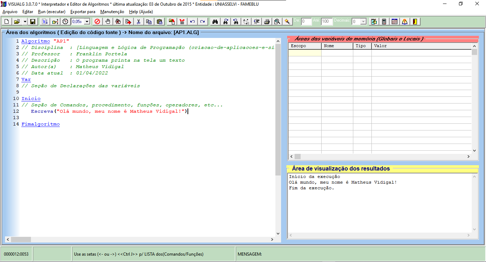

**R e s p o s t a - - - - - - - - - - - - - - - - - - - - - - - - - - - - - -**

*comando usado:*
```java
Escreva("Olá mundo, meu nome é ...!")
```

*programa completo:*
```java
Algoritmo "AP1"
// Disciplina  : [Linguagem e Lógica de Programação (criacao-de-aplicacoes-e-sistemas)]
// Professor   : Franklin Portela
// Descrição   : O programa printa na tela um texto
// Autor(a)    : ...
// Data atual  : __/04/2022
Var
// Seção de Declarações das variáveis

Inicio
// Seção de Comandos, procedimento, funções, operadores, etc...
   Escreva("Olá mundo, meu nome é ...!")

Fimalgoritmo
```

