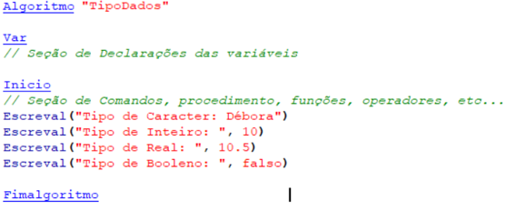

# Tipos de Dados e Instruções Primitivas
- 4 Vídeos
- 1 Texto
- 6 Questões
- 1 Atividade Prática

## Alteração de Tipos de Dados 📝
**Aulas Envolvidas nesta Prática:** Tipos de Dados e Instruções Primitivas

**Objetivos:** Praticar lógica de programação e desenvolvimento de algoritmos

**Materiais, Métodos e Ferramentas:** Para realizar este exercício, vamos utilizar Visualg para testar o algoritmo proposto no desenvolvimento da prática em questão

**Atividade Prática** 
Utilize o algoritmo abaixo “TipoDados” como exemplo e desenvolva um algoritmo em pseudocódigo onde os valores nome, idade, altura e criança sejam diferentes do algoritmo exemplo.

Exemplo:

Após desenvolver seu código conforme a descrição acima, copie e cole na caixa de texto (a resposta da Atividade Prática sempre será em código (pseudocódigo))