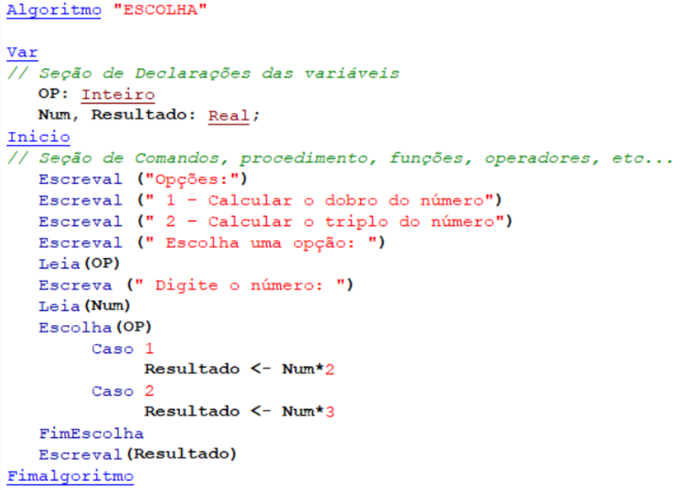

# Estruturas de Decisão
- 4 Vídeos
- 1 Texto
- 6 Questões
- 1 Atividade Prática

## Maior Número 📝
**Aulas Envolvidas nesta Prática:** Tomada de Decisão

**Objetivos:** Praticar lógica de programação e desenvolvimento de algoritmos

**Materiais, Métodos e Ferramentas:** Para realizar este exercício, vamos utilizar Visualg para testar o algoritmo proposto no desenvolvimento da prática em questão

**Atividade Prática** 
A - Com os conhecimentos adquiridos até agora, desenvolva um algoritmo em pseudocódigo que solicita ao usuário digitar 2 números. Após o usuário digitar teste se o primeiro número digitado é menor que o segundo número digitado, se verdadeiro mostre na tela o número maior, senão mostre os 2 números digitados. 
B - Execute o código do exemplo abaixo e mostre o resultado das escolhas: Opção 1 e o número 25. Em um novo teste, Opção 2 e o número 100

Após desenvolver seu código conforme a descrição acima, copie e cole na caixa de texto (a resposta da Atividade Prática sempre será em código (pseudocódigo))