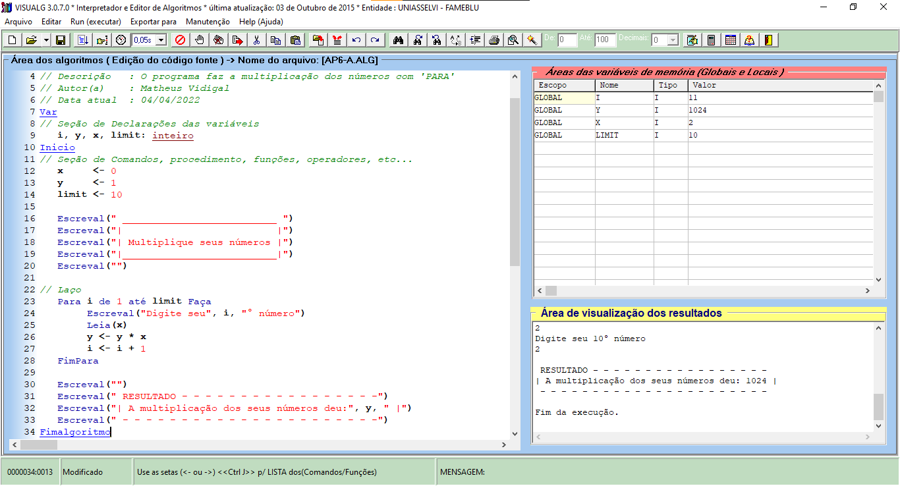
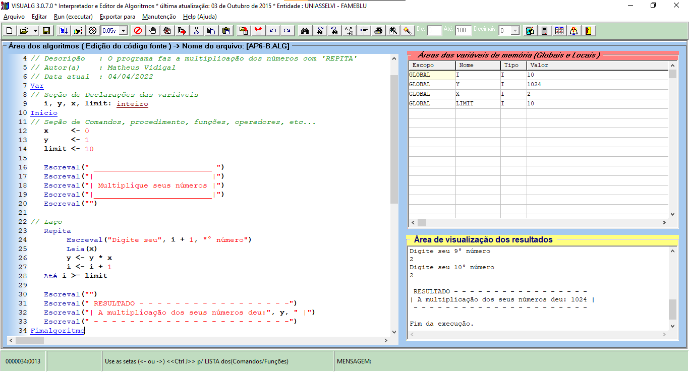

**R e s p o s t a - - - - - - - - - - - - - - - - - - - - - - - - - - - - - -**

**( AP - A )**<br>
*comandos usados:*
```java
    Para i de 1 até 10 Faça
        Escreval("Digite seu", i, "° número")
        Leia(x)
        y <- y * x
        i <- i + 1
    FimPara
    Escreval("A multiplicação dos seus números deu:", y)
```

*programa completo:*
```java
Algoritmo "AP6-A"
// Disciplina  : [Linguagem e Lógica de Programação (criacao-de-aplicacoes-e-sistemas)]
// Professor   : Franklin Portela Correia
// Descrição   : O programa faz a multiplicação dos números com 'PARA'
// Autor(a)    : Matheus Vidigal
// Data atual  : 04/04/2022
Var
// Seção de Declarações das variáveis
    i, y, x, limit: inteiro
Inicio
// Seção de Comandos, procedimento, funções, operadores, etc...
    x     <- 0
    y     <- 1
    limit <- 10

    Escreval(" __________________________ ")
    Escreval("|                          |")
    Escreval("| Multiplique seus números |")
    Escreval("|__________________________|")
    Escreval("")

// Laço
    Para i de 1 até limit Faça
        Escreval("Digite seu", i, "° número")
        Leia(x)
        y <- y * x
        i <- i + 1
    FimPara

    Escreval("")
    Escreval(" RESULTADO - - - - - - - - - - - - - - - - -")
    Escreval("| A multiplicação dos seus números deu:", y, " |")
    Escreval(" - - - - - - - - - - - - - - - - - - - - - -")
Fimalgoritmo
```



**- - - - - - - - - - - - - - - - - - - - - - - - - - - - - -**

**( AP - B )**<br>
*comandos usados:*
```java
    Repita
        Escreval("Digite seu", i + 1, "° número")
        Leia(x)
        y <- y * x
        i <- i + 1
    Até i >= limit
    Escreval("| A multiplicação dos seus números deu:", y, " |")
```

*programa completo:*
```java
Algoritmo "AP6-B"
// Disciplina  : [Linguagem e Lógica de Programação (criacao-de-aplicacoes-e-sistemas)]
// Professor   : Franklin Portela Correia
// Descrição   : O programa faz a multiplicação dos números com 'REPITA'
// Autor(a)    : Matheus Vidigal
// Data atual  : 04/04/2022
Var
// Seção de Declarações das variáveis
    i, y, x, limit: inteiro
Inicio
// Seção de Comandos, procedimento, funções, operadores, etc...
    x     <- 0
    y     <- 1
    limit <- 10

    Escreval(" __________________________ ")
    Escreval("|                          |")
    Escreval("| Multiplique seus números |")
    Escreval("|__________________________|")
    Escreval("")

// Laço
    Repita
        Escreval("Digite seu", i + 1, "° número")
        Leia(x)
        y <- y * x
        i <- i + 1
    Até i >= limit

    Escreval("")
    Escreval(" RESULTADO - - - - - - - - - - - - - - - - -")
    Escreval("| A multiplicação dos seus números deu:", y, " |")
    Escreval(" - - - - - - - - - - - - - - - - - - - - - -")
Fimalgoritmo
```

