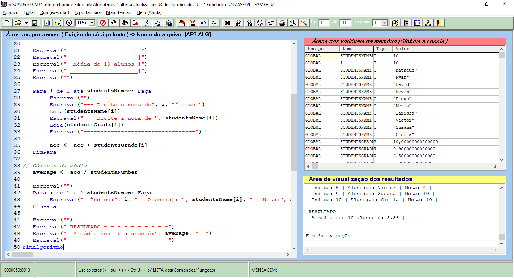

**R e s p o s t a - - - - - - - - - - - - - - - - - - - - - - - - - - - - - -**

*comandos usados:*
```java
    studentsName:  vetor [1..10] de caracter
    Para i de 1 até studentsNumber Faça
        Escreval("--- Digite o nome do", i, "° aluno")
        Leia(studentsName[i])
        Escreval("--- Digite a nota de ", studentsName[i])
        Leia(studentsGrade[i])

        acc <- acc + studentsGrade[i]
    FimPara
    average <- acc / studentsNumber

    Para i de 1 até studentsNumber Faça
        Escreval("| Índice:", i, " | Aluno(a): ", studentsName[i], " | Nota:", studentsGrade[i], " |")
    FimPara
    Escreval("A média dos 10 alunos é:", average)
```

*programa completo:*
```java
Algoritmo "AP7"
// Disciplina  : [Linguagem e Lógica de Programação (criacao-de-aplicacoes-e-sistemas)]
// Professor   : Franklin Portela Correia
// Descrição   : O programa calcula a média de 10 alunos
// Autor(a)    : Matheus Vidigal
// Data atual  : 05/04/2022
Var
// Seção de Declarações das variáveis
    studentsNumber, i: inteiro

    studentsName:  vetor [1..10] de caracter
    studentsGrade: vetor [1..10] de real

    acc, average: real
Inicio
// Seção de Comandos, procedimento, funções, operadores, etc...
    acc     <- 0
    average <- 0
    studentsNumber <- 10

    Escreval(" ____________________ ")
    Escreval("|                    |")
    Escreval("| Média de 10 alunos |")
    Escreval("|____________________|")
    Escreval("")

    Para i de 1 até studentsNumber Faça
        Escreval("")
        Escreval("--- Digite o nome do", i, "° aluno")
        Leia(studentsName[i])
        Escreval("--- Digite a nota de ", studentsName[i])
        Leia(studentsGrade[i])
        Escreval("---------------------------------")

        acc <- acc + studentsGrade[i]
    FimPara

// Cálculo da média
    average <- acc / studentsNumber

    Escreval("")
    Para i de 1 até studentsNumber Faça
        Escreval("| Índice:", i, " | Aluno(a): ", studentsName[i], " | Nota:", studentsGrade[i], " |")
    FimPara

    Escreval("")
    Escreval(" RESULTADO - - - - - - - - - -")
    Escreval("| A média dos 10 alunos é:", average, " |")
    Escreval(" - - - - - - - - - - - - - - -")
Fimalgoritmo
```

