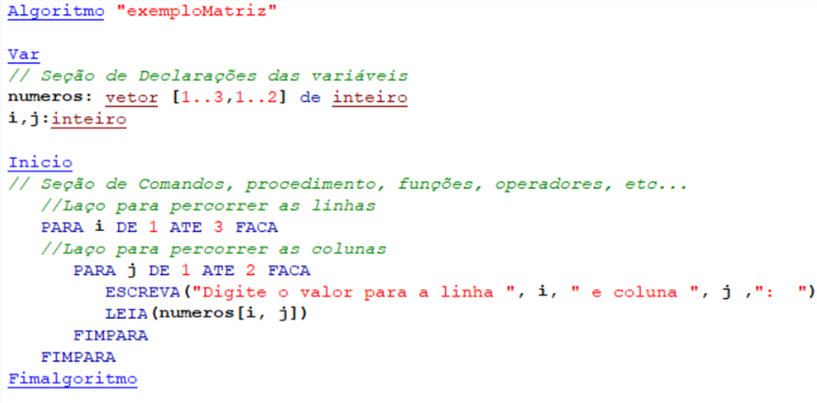

# Matriz
- 4 Vídeos
- 1 Texto
- 6 Questões
- 1 Atividade Prática

## Soma de Matriz 📝
**Aulas Envolvidas nesta Prática:** Matriz

**Objetivos:** Praticar lógica de programação e desenvolvimento de algoritmos

**Materiais, Métodos e Ferramentas:** Para realizar este exercício, vamos utilizar Visualg para testar o algoritmo proposto no desenvolvimento da prática em questão

**Atividade Prática** 
Com base no exemplo abaixo e com os conhecimentos adquiridos até agora, desenvolva um algoritmo em pseudocódigo com uma matriz 5x5 que some cada valor de uma posição da matriz com 10. Mostre o resultado na tela

Exemplo:

Após desenvolver seu código conforme a descrição acima, copie e cole na caixa de texto (a resposta da Atividade Prática sempre será em código (pseudocódigo))