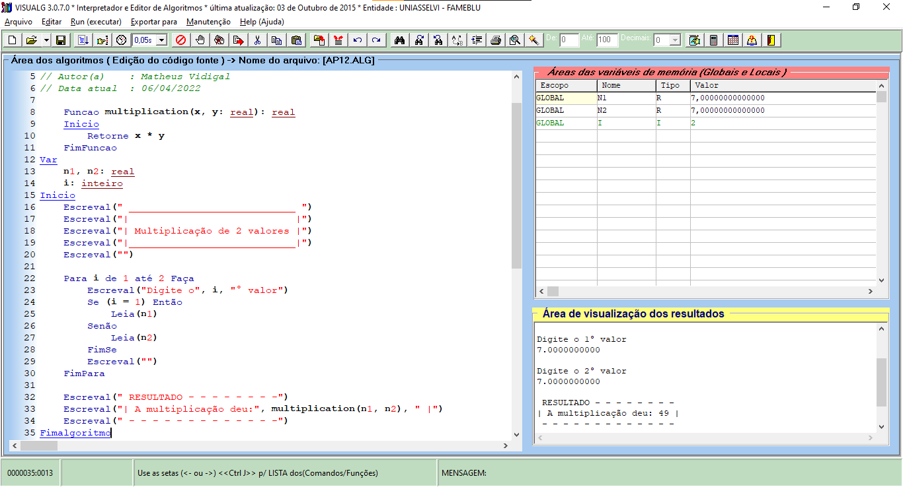

**R e s p o s t a - - - - - - - - - - - - - - - - - - - - - - - - - - - - - -**

*comandos usados:*
```java
    Funcao multiplication(x, y: real): real
    Inicio
        Retorne x * y
    FimFuncao

    Escreval("Digite o 1° valor")
    Leia(n1)

    Escreval("A multiplicação deu:", multiplication(n1, n2))
```

*programa completo:*
```java
Algoritmo "AP12"
// Disciplina  : [Linguagem e Lógica de Programação (criacao-de-aplicacoes-e-sistemas)]
// Professor   : Lucy Mari Tabuti
// Descrição   : O programa multiplica 2 valores com 'FUNÇÃO e PARÂMETROS'
// Autor(a)    : Matheus Vidigal
// Data atual  : 06/04/2022

    Funcao multiplication(x, y: real): real
    Inicio
        Retorne x * y
    FimFuncao
Var
    n1, n2: real
    i: inteiro
Inicio
    Escreval(" ____________________________ ")
    Escreval("|                            |")
    Escreval("| Multiplicação de 2 valores |")
    Escreval("|____________________________|")
    Escreval("")

    Para i de 1 até 2 Faça
        Escreval("Digite o", i, "° valor")
        Se (i = 1) Então
            Leia(n1)
        Senão
            Leia(n2)
        FimSe
        Escreval("")
    FimPara

    Escreval(" RESULTADO - - - - - - - -")
    Escreval("| A multiplicação deu:", multiplication(n1, n2), " |")
    Escreval(" - - - - - - - - - - - - -")
Fimalgoritmo
```

