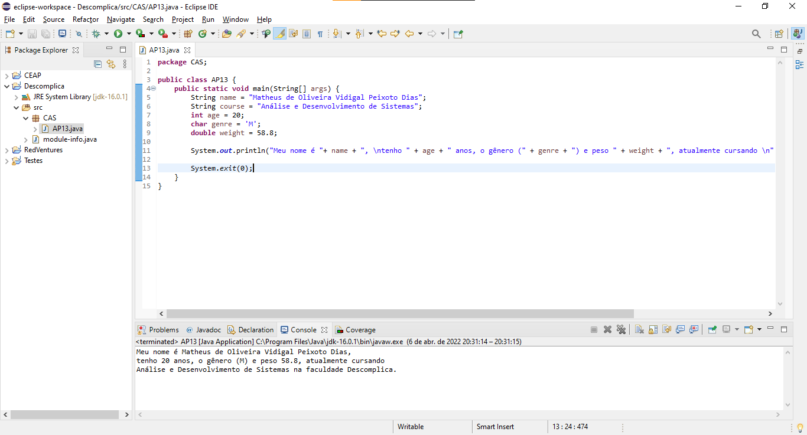

**R e s p o s t a - - - - - - - - - - - - - - - - - - - - - - - - - - - - - -**

*comandos usados:*
```java
    System.out.println("Meu nome é "+ name + ", \ntenho " + age + " anos, o gênero (" + genre + ") e peso " + weight + ", atualmente cursando \n" + course + " na faculdade Descomplica.");
```

*programa completo:*
```java
package CAS;

public class AP13 {
	public static void main(String[] args) {
		String name = "Matheus de Oliveira Vidigal Peixoto Dias";
		String course = "Análise e Desenvolvimento de Sistemas";
		int age = 20;
		char genre = 'M';
		double weight = 58.8;

		System.out.println("Meu nome é "+ name + ", \ntenho " + age + " anos, o gênero (" + genre + ") e peso " + weight + ", atualmente cursando \n" + course + " na faculdade Descomplica.");

		System.exit(0);
	}
}
```

