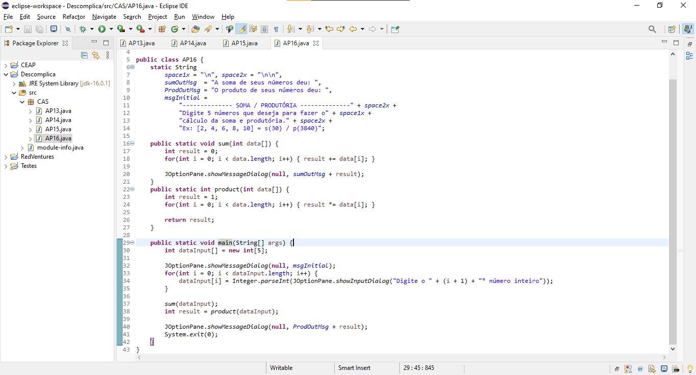

**R e s p o s t a - - - - - - - - - - - - - - - - - - - - - - - - - - - - - -**

*comandos usados:*
```java
int dataInput[] = new int[5];

for(int i = 0; i < dataInput.length; i++) {
	dataInput[i] = Integer.parseInt(JOptionPane.showInputDialog("Digite o " + (i + 1) + "° número inteiro"));
}

sum(dataInput);
	for(int i = 0; i < data.length; i++) { result += data[i]; }

int result = product(dataInput);
	for(int i = 0; i < data.length; i++) { result *= data[i]; }

JOptionPane.showMessageDialog(null, ProdOutMsg + result);
```

*programa completo:*
```java
package CAS;

import javax.swing.JOptionPane;

public class AP16 {
	static String
		space1x = "\n", space2x = "\n\n",
		sumOutMsg  = "A soma de seus números deu: ",
		ProdOutMsg = "O produto de seus números deu: ",
		msgInitial =
			"-------------- SOMA / PRODUTÓRIA --------------" + space2x +
			"Digite 5 números que deseja para fazer o" + space1x +
			"cálculo da soma e produtória." + space2x +
			"Ex: [2, 4, 6, 8, 10] = s(30) / p(3840)";

	public static void sum(int data[]) {
		int result = 0;
		for(int i = 0; i < data.length; i++) { result += data[i]; }

		JOptionPane.showMessageDialog(null, sumOutMsg + result);
	}
	public static int product(int data[]) {
		int result = 1;
		for(int i = 0; i < data.length; i++) { result *= data[i]; }

		return result;
	}

	public static void main(String[] args) {
		int dataInput[] = new int[5];

		JOptionPane.showMessageDialog(null, msgInitial);
		for(int i = 0; i < dataInput.length; i++) {
			dataInput[i] = Integer.parseInt(JOptionPane.showInputDialog("Digite o " + (i + 1) + "° número inteiro"));
		}

		sum(dataInput);
		int result = product(dataInput);

		JOptionPane.showMessageDialog(null, ProdOutMsg + result);
		System.exit(0);
	}
}
```

